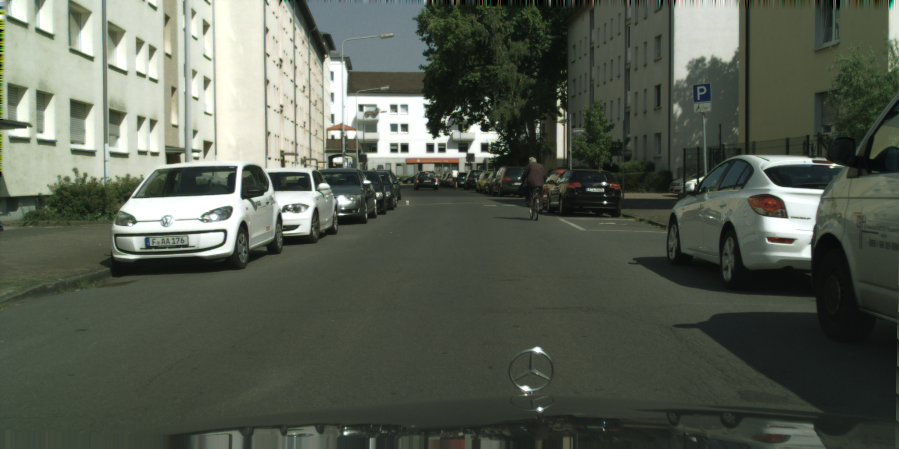
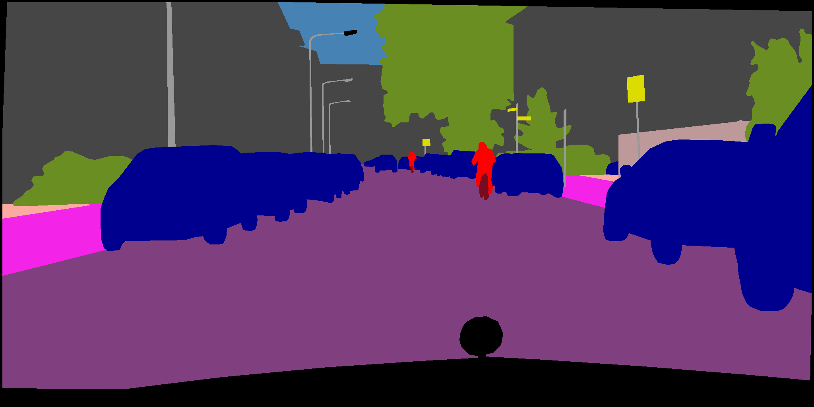

# LEDNet
This is an unofficial implement of  [LEDNet](https://arxiv.org/abs/1905.02423). 

> the official version：[LEDNet-official](https://github.com/xiaoyufenfei/LEDNet)

<div align="center">

</div>
## Environment

- Python 3.6
- PyTorch 1.1

## Performance

- Base Size 1024, Crop Size 768, only fine. (new-version, with dropout)

| Model  | Paper | OHEM | Drop-rate |   lr   | Epoch | val (crop)  |                             val                              |
| :----: | :---: | :--: | :-------: | :----: | :---: | :---------: | :----------------------------------------------------------: |
| LEDNet |   /   |  ✗   |    0.1    | 0.0005 |  800  | 60.32/94.51 |                         66.29/94.40                          |
| LEDNet |   /   |  ✗   |    0.1    | 0.005  |  600  | 61.29/94.75 |                         66.56/94.72                          |
| LEDNet |   /   |  ✗   |    0.3    |  0.01  |  800  | 63.84/94.83 | [69.09/94.75](https://drive.google.com/open?id=1oelPUKAnZYD75RruyBQU9HZKneMEMIAp) |

> Note:
>
> - The paper only provide the test results: 69.2/86.8 (class mIoU/category mIoU). 
> - And the training setting is a little different with original paper (original paper use 1024x512)

Some things you can use to improve the performance:

1. use larger learning rate (like 0.01)
2. use more epochs (like 1000)
3. use larger training input size (like Base Size 1344, Crop Size 1024)

## Demo

Please download [pretrained](https://drive.google.com/open?id=1oelPUKAnZYD75RruyBQU9HZKneMEMIAp) model first

```shell
$ python demo.py [--input-pic png/demo.png] [--pretrained your-root-of-pretrained] [--cuda true]
```

## Evaluation

The default data root is `~/.torch/datasets` (You can download dataset and build a soft-link to it)

```shell
$ python eval.py [--mode testval] [--pretrained root-of-pretrained-model] [--cuda true]
```

## Training

Recommend to using distributed training.

```shell
$ export NGPUS=4
$ python -m torch.distributed.launch --nproc_per_node=$NGPUS train.py [--dataset citys] [--batch-size 8] [--base-size 1024] [--crop-size 768] [--epochs 800] [--warmup-factor 0.1] [--warmup-iters 200] [--log-step 10] [--save-epoch 40] [--lr 0.005]
```

## Prepare data

Your can reference [gluon-cv-cityspaces](https://gluon-cv.mxnet.io/build/examples_datasets/cityscapes.html#sphx-glr-build-examples-datasets-cityscapes-py) to prepare the dataset

